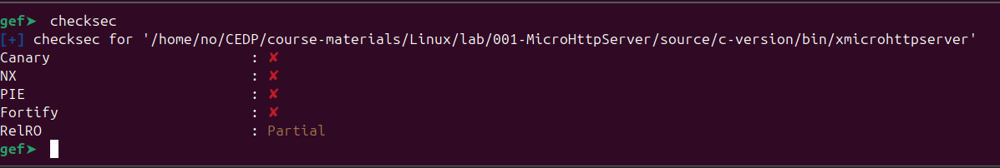
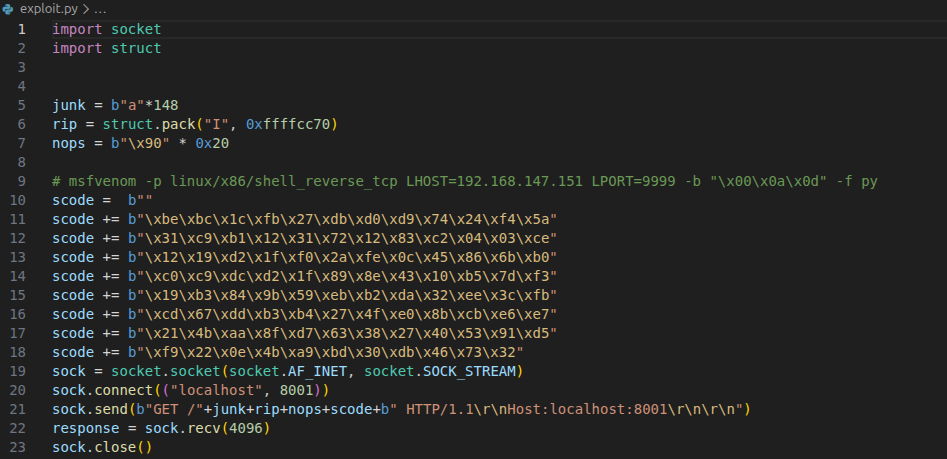

# Learning BOF — MicroHttpServer (Linux x86)

## Overview

This write-up documents a **stack-based buffer overflow (BOF)** learning exercise performed against **MicroHttpServer (Linux x86)**. The goal of this lab is to understand **memory corruption**, **EIP control**, and **shellcode execution** through a controlled HTTP-based attack surface.

This is a **training-focused exploit**, written to build low-level exploitation skills rather than to deliver a production-grade weaponized exploit.

---

## Target Information

* **Application:** MicroHttpServer
* **Architecture:** x86 (32-bit)
* **Operating System:** Linux
* **Vulnerability Class:** Stack-Based Buffer Overflow
* **Attack Vector:** HTTP GET request
* **Shell Type:** Reverse TCP shell

---

## Binary Protections Analysis

The binary was analyzed using `checksec` to identify enabled mitigations.

**Results:**

* Stack Canary: ❌ Disabled
* NX (Non-Executable Stack): ❌ Disabled
* PIE: ❌ Disabled
* RELRO: ⚠️ Partial

**Impact:**
With NX and PIE disabled, direct execution of shellcode from the stack is possible, making this binary suitable for classic stack-based exploitation techniques.

---

## Crash Analysis & EIP Control

An initial payload containing repeated `A` characters was sent to the server to trigger a crash and validate memory corruption.

Debugger inspection confirmed:

* The application crashes reliably
* The instruction pointer (**EIP**) is overwritten with `0x41414141`

This confirms **full control of execution flow**.

---

## Offset & Stack Control Strategy

After confirming EIP control:

* The exact offset to EIP was determined
* The return address was redirected to a stack address (ESP)
* A **NOP sled** was used to increase execution reliability

The final payload structure:

1. Buffer padding (junk)
2. Overwritten return address (pointing to stack)
3. NOP sled
4. Shellcode

---

## Shellcode Preparation

Shellcode characteristics:

* Platform: Linux x86
* Payload: Reverse TCP shell
* Generator: `msfvenom`
* Bad characters removed

The shellcode was embedded directly into the HTTP request body.

---

## Exploit Script

The exploit was written in Python and uses raw socket communication to send a crafted HTTP request containing the overflow payload.

Key components:

* Controlled buffer size
* Precise return address overwrite
* Inline shellcode execution

---

## Exploit Execution

When the exploit is executed:

* The server parses the malicious request
* Execution flow is redirected to the stack
* Shellcode is executed successfully

Debugger output confirms execution of `/usr/bin/dash`, proving arbitrary code execution.

---

## Reverse Shell Verification

A Netcat listener receives an inbound connection from the target, confirming successful exploitation.

Verification steps:

* `id`
* `whoami`

Execution occurs under the context of the vulnerable service.

---

## Key Learning Outcomes

* Understanding stack memory layout in x86 binaries
* Practical EIP overwrite verification
* Relationship between binary protections and exploit feasibility
* Reliable shellcode execution through protocol-based input
* Difference between crash-based testing and controlled exploitation

---

## Defensive Takeaways

* Enabling NX, PIE, and stack canaries would prevent this attack
* Proper bounds checking eliminates this vulnerability class
* Legacy binaries without hardening remain highly exploitable

---

## Conclusion

This lab demonstrates a full **stack-based buffer overflow exploitation lifecycle**, from crash discovery to shell access. It reinforces fundamental exploit development concepts required for advanced offensive security and exploit research.

This exercise is intended strictly for **educational and defensive research purposes**.

## Author: SUB-ZERO

## [LinkedIn:](https://www.linkedin.com/in/salman-hussein-3615852a4/)
